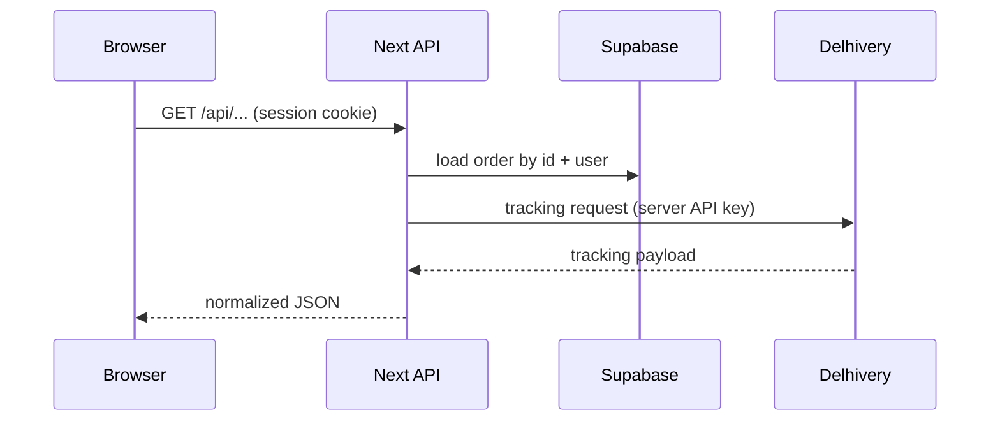

# Order tracking (Delhivery) — design

**Date:** 2026-03-26  
**Scope:** Customer-facing order tracking on the storefront using Delhivery B2C Order Tracking API.  
**Reference:** [Delhivery B2C — Order tracking](https://one.delhivery.com/developer-portal/document/b2c/detail/order-tracking)

## 1. Goals and non-goals

**Goals**

- Show **live shipment status and scan history** for a customer’s order when a Delhivery waybill exists.
- **Never** expose Delhivery API tokens or raw integration details to the browser.
- Enforce **authorization**: only the owning user can track an order (by `order_id`).

**Non-goals (v1)**

- Multi-parcel orders (multiple AWBs per order); assume **one** `tracking_number` per order unless product later adds schema.
- Tracking on the **orders list** beyond a **link** to the detail page (avoids N+1 Delhivery calls).
- Admin shipment creation or label APIs (handled in admin app per existing plan).

## 2. Approaches considered

| Approach | Summary | Pros | Cons |
|----------|---------|------|------|
| **A — Detail-only, on fetch** | Call Delhivery when user opens `/orders/[id]` | Simplest | Repeat refreshes hit Delhivery every time |
| **B — Detail + TanStack Query (recommended)** | Same API route; client caches with `staleTime` (e.g. 2–5 min) | Fewer duplicate calls; fits existing React Query usage | Slightly more client code |
| **C — Server + Redis cache** | Cache Delhivery responses by AWB | Lowest Delhivery load | Extra infra, TTL/invalidation policy; YAGNI for v1 |

**Recommendation:** **B** for the detail page; **A-style link-only** on the orders list (`/orders` → “View tracking” → detail).

## 3. Data model

- **`orders.tracking_number`** stores the Delhivery **waybill / AWB** when the shipment is created (admin/backend).
- If `tracking_number` is missing or order status is pre-shipment (`payment_*`, `processing` without ship), the UI shows **no live tracking** (optional short copy: “Tracking will appear after dispatch”).

## 4. Architecture

- **New route:** e.g. `GET /api/shipping/order-tracking?orderId=<uuid>` (exact path to match existing `app/api/shipping/` convention).
- **Server steps:** (1) Supabase auth → `user`. (2) `select` order by `id` and `user_id = user.id` with `tracking_number` (and optionally `status` for gating). (3) If no row or no waybill → `404` or `400` with clear message. (4) Call Delhivery per official doc (URL, method, headers — typically token + waybill parameters as documented). (5) Return a **normalized** JSON shape for the UI (map Delhivery fields in one place).

**Environment**

- Reuse **`DELHIVERY_API_KEY`** (already used for pincode). If B2C tracking uses a **different base URL** than pincode (`DELHIVERY_BASE_URL` / `https://track.delhivery.com`), add **`DELHIVERY_TRACKING_BASE_URL`** (optional override) so production/staging can diverge without code changes. Implement per portal doc.

**Parallelism / performance**

- Single Delhivery round-trip per request; no sequential waterfalls inside the handler beyond auth → DB → Delhivery.

## 5. Client UX

**Order detail (`/orders/[id]`)**

- New **“Shipment tracking”** section (below existing tracking number block or merged): timeline or list of **status / location / time** from normalized API response.
- **Loading / error / empty:** skeleton or spinner; toast or inline error if Delhivery fails; if no AWB, keep current static display only.

**Orders list (`/orders`)**

- For orders with `tracking_number`, add **“Track shipment”** (or similar) **link** to `/orders/[id]` (anchor optional, e.g. `#shipment-tracking` for focus).

**Do not** call the tracking API for every row on the list.

## 6. Error handling and security

- **401** if unauthenticated.
- **403/404** if order not found or not owned by user (avoid leaking existence of other users’ order IDs).
- **502/503** with generic message if Delhivery is down or returns unexpected shape (log server-side).
- Do not log full API keys; log order id + correlation-friendly error codes only.

## 7. Types and mapping

- Add **`lib/types/delhivery-tracking.ts`** (or under `lib/types/shipping.ts`) for **normalized** tracking DTO consumed by the UI; map Delhivery response in the API route or a tiny `lib/server/delhivery-tracking.ts` helper.

## 8. Testing

- **Manual:** order with test AWB in staging; unauthenticated; wrong user; missing `tracking_number`.
- **Optional later:** unit test mapper with fixture JSON from Delhivery docs.

## 9. Implementation plan (next step)

After this spec is approved, use **writing-plans** to produce a file under `docs/superpowers/plans/` with ordered tasks: API route + types + detail UI + list link + env README/CLAUDE note if new env var.

---

**Approval:** Product/engineering sign-off on scope (detail + list link, single AWB, server-only Delhivery).
